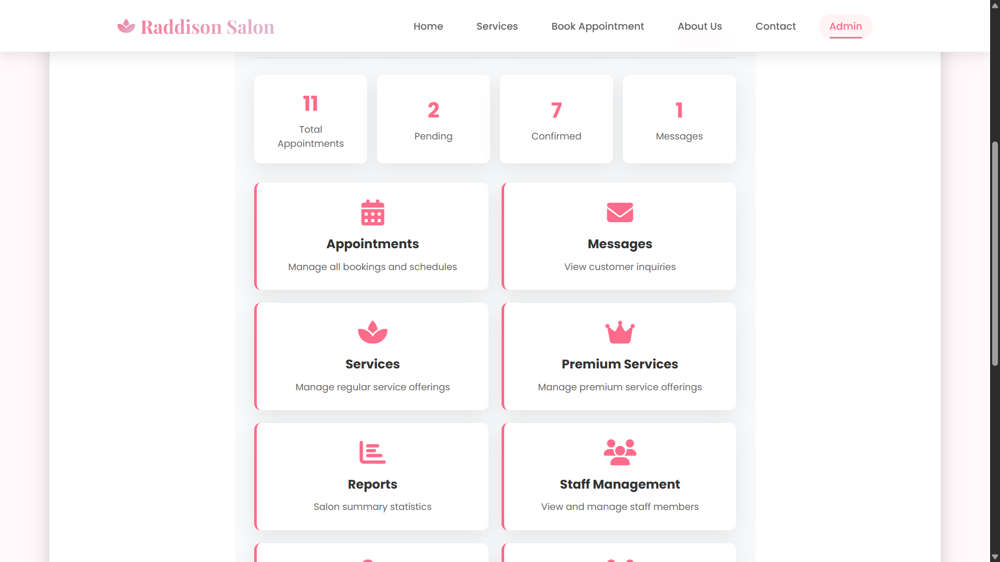

# 💇‍♀️ Raddison Salon - Beauty & Wellness Management System

Welcome to **Raddison Salon**, a modern and elegant web-based salon management system built to streamline appointment bookings, service management, and customer interactions. This project brings together beauty and technology to create a seamless experience for both salon staff and customers.


  
<br>
<br>
--- 
## ✨ Features

### 🎨 For Customers
- **Browse Services**: Explore our collection of regular and premium beauty services with detailed descriptions
- **Easy Booking**: Book appointments with your preferred staff member and time slot
- **Service Categories**: 
  - Regular Services (Haircuts, Styling, Grooming, Facials, etc)
  - Premium Services (Luxury Spa, Gold Facial, Diamond Glow treatments, etc)
- **Contact Us**: Send inquiries and feedback directly through the website
- **Responsive Design**: Beautiful, mobile-friendly interface that works on all devices
- **Real-time Availability**: See available time slots and service durations

### 👨‍💼 For Administrators
- **Dashboard Overview**: Get insights into appointments, customers, and services at a glance
- **Appointment Management**: 
  - View, create, edit, and cancel appointments
  - Update appointment status (Scheduled, Completed, Cancelled)
  - Add notes for special customer requests
  - Expandable notes feature for detailed information
- **Staff Management**: Add, edit, and remove staff members with role assignments
- **Customer Database**: Maintain customer records with contact information
- **Service Management**:
  - Separate tabs for Regular and Premium services
  - Create, update, and delete services
  - Set pricing and duration for each service
- **Message Center**: View and manage customer inquiries from the contact form
- **Secure Login**: Password-protected admin panel with bcrypt encryption

### 🔐 Security Features
- Hashed password storage using bcrypt
- Database reconnection with exponential backoff
- Foreign key constraints for data integrity
- SQL injection prevention with parameterized queries
- Secure admin authentication

<br>

---

## 📸 Screenshots

### Homepage

*Welcome page featuring our elegant pastel-themed design with salon introduction and call-to-action*

### Services

*Browse through our comprehensive collection of regular beauty services with detailed descriptions and pricing*


*Premium luxury services section showcasing our exclusive spa and treatment packages fetched live from database*

### Book Appointment

*Easy-to-use appointment booking form with customer details, service selection, and preferred time slots*

### About Us

*Learn about Raddison Salon's story, mission, and commitment to beauty excellence*


*Meet our professional team (data is fetched directly from database not hard-coded)*

### Contact Us

*Get in touch with us through our contact form or find our location and business hours. Send a message which can be displayed through admin dashboard*

### Admin Dashboard

*Comprehensive admin panel overview showing appointments, customers, and service management*


*Appointment management interface with status tracking, notes, and expandable details*


*Staff management section for adding, editing, and organizing salon employees*


*Customer database with contact information and relationship tracking*


*Service management with separate tabs for regular and premium services, including pricing and duration settings*

<br>

---  

## 🛠️ Tech Stack

**Frontend:**
- HTML5, CSS3 (Custom pastel-themed design)
- Vanilla JavaScript (ES6+)
- Font Awesome Icons
- Google Fonts (Poppins & Playfair Display)  
<br>

**Backend:**
- Node.js (v18+)
- Express.js (v4.18.2)
- MySQL2 (v3.6.0)  
<br>

**Security & Utilities:**
- bcrypt (v6.0.0) - Password hashing
- dotenv (v16.3.1) - Environment variables
- cors (v2.8.5) - Cross-origin resource sharing
- body-parser (v1.20.2) - Request parsing  
<br>
<br>

---

## 📋 Prerequisites

Before you begin, make sure you have the following installed:

- **Node.js** (version 18 or higher) - [Download here](https://nodejs.org/)
- **MySQL** (version 8.0 or higher) - [Download here](https://www.mysql.com/downloads/)
- **Git** (optional, for cloning) - [Download here](https://git-scm.com/install/)
- A text editor like **VS Code** - [Download here](https://code.visualstudio.com/)


## 🚀 Installation & Setup

### Step 1: Clone or Download the Project

**Option A: Clone with Git**
```bash
git clone https://github.com/DBMS-4/raddison-salon.git
cd raddison-salon
```
<br>

**Option B: Download ZIP (No Git Required)**
1. Go to [https://github.com/DBMS-4/raddison-salon](https://github.com/DBMS-4/raddison-salon)
2. Click the green **"Code"** button → **"Download ZIP"**
3. Extract the ZIP file to your desired location
4. Open terminal/command prompt in the extracted folder  
<br>

### Step 2: Install Dependencies

Open your terminal in the project directory and run:

```bash
npm install
```

This will install all the required packages listed in `package.json`.

### Step 3: Set Up MySQL Database

1. **Start MySQL Server**
   - Make sure your MySQL service is running
   - Open MySQL Workbench or command line

2. **Create the Database**
   ```sql
   CREATE DATABASE raddison_salon;
   ```

3. **Import the Database Schema**
   
   Run the `database.sql` file to create all tables and insert sample data:
   
   **Using MySQL Command Line:**
   ```bash
   mysql -u your_username -p raddison_salon < database.sql
   ```
   
   **Using MySQL Workbench:**
   - Open MySQL Workbench
   - File → Run SQL Script
   - Select `database.sql`
   - Click "Run"

### Step 4: Configure Environment Variables

**Easy Method:** Rename `.env.example` to `.env`

Then edit the `.env` file with your MySQL credentials:
```env
# Database Configuration
DB_HOST=localhost
DB_USER=root
DB_PASSWORD=your_mysql_password
DB_NAME=raddison_salon
DB_PORT=3306

# Server Configuration
PORT=3000
```

**⚠️ Important:** Replace `your_mysql_password` with your actual MySQL password!

### Step 5: Start the Server

Run the application:

```bash
# For development (with auto-restart on changes)
npm run dev

# For production
npm start
```

You should see:
```
Server is running on port 3001
Connected to MySQL database successfully!
```

### Step 6: Access the Application

Open your web browser and visit:

- **Homepage**: `http://localhost:3000`
- **Services Page**: `http://localhost:3000/services.html`
- **Book Appointment**: `http://localhost:3000/appointment.html`
- **About Us**: `http://localhost:3000/about.html`
- **Contact**: `http://localhost:3000/contact.html`
- **Admin Panel**: `http://localhost:3000/admin.html`  
<br>  
<br>

---

## 🔑 Default Admin Credentials

Use these credentials to access the admin panel:

```
Username: admin
Password: ADMIN1234
```

**⚠️ Important:** Please change the default password after your first login for security purposes!

<br>

---
## 📁 Project Structure

```
raddison-salon/
│
├── public/                          # Frontend files
│   ├── index.html                   # Homepage
│   ├── services.html                # Services listing
│   ├── appointment.html             # Booking form
│   ├── about.html                   # About page
│   ├── contact.html                 # Contact form
│   └── admin.html                   # Admin dashboard
│
├── server.js                        # Express server & API routes
├── database.sql                     # Database schema & sample data
├── package.json                     # Node.js dependencies
├── .env.example                     # Environment variables template
├── .env                            # Your actual credentials
├── .gitignore                      # Files to ignore in Git
├── LICENSE                         # Custom license file
└── README.md                       # This file!
```
<br>  
<br>

---

## 🔌 API Endpoints

### Services
- `GET /api/services` - Get all regular services
- `GET /api/premium` - Get all premium services
- `GET /api/all-services` - Get all services
- `POST /api/services` - Create a new service
- `PUT /api/services/:id` - Update a service
- `DELETE /api/services/:id` - Delete a service

### Appointments
- `GET /api/appointments` - Get all appointments
- `POST /api/appointments` - Create an appointment
- `PUT /api/appointments/:id` - Update appointment
- `PUT /api/appointments/:id/status` - Update appointment status
- `DELETE /api/appointments/:id` - Delete appointment

### Staff
- `GET /api/staff` - Get all staff members
- `POST /api/staff` - Add new staff
- `PUT /api/staff/:id` - Update staff info
- `DELETE /api/staff/:id` - Remove staff

### Customers
- `GET /api/customers` - Get all customers
- `POST /api/customers` - Add new customer
- `PUT /api/customers/:id` - Update customer
- `DELETE /api/customers/:id` - Delete customer

### Messages
- `GET /api/messages` - Get all messages
- `POST /api/messages` - Submit contact form
- `DELETE /api/messages/:id` - Delete message

### Admin
- `POST /api/admin/login` - Admin authentication
  
<br>
<br>

---

## 🎨 Design Features

- **Pastel Color Scheme**: Soft pink and lavender tones for a welcoming feel
- **Mobile Responsive**: Works beautifully on phones, tablets, and desktops
- **Smooth Animations**: Hover effects and transitions for a polished experience
- **Accessible Navigation**: Mobile hamburger menu with smooth transitions
- **Service Cards**: Flexbox-aligned cards with consistent button positioning
- **Admin Dashboard**: Clean, organized interface for easy management

<br>
<br>

---
## 🐛 Troubleshooting

### Server won't start
- Make sure MySQL is running
- Check if port 3000 is already in use
- Verify your `.env` file has correct database credentials

### Database connection failed
- Confirm MySQL service is running
- Double-check username and password in `.env`
- Ensure the database `raddison_salon` exists
- Check if the port (default 3306) is correct

### "Cannot find module" error
- Run `npm install` to install all dependencies
- Delete `node_modules` folder and run `npm install` again

### Admin login not working
- Make sure the `Admins` table has the default user
- Verify bcrypt is installed: `npm install bcrypt`

<br>
<br>

---

## 🤝 Contributing

While this is a personal project, suggestions and feedback are always welcome! Feel free to:
- Report bugs by creating an issue
- Suggest new features
- Share your experience using the system

<br>
<br>

---

## 📝 Database Schema

The system uses **6 main tables**:

1. **Staff** - Store employee information
2. **Customers** - Customer database with contact details
3. **Services** - Both regular and premium services
4. **Appointments** - Booking records with status tracking
5. **Messages** - Contact form submissions
6. **Admins** - Admin user accounts

For detailed schema, see `database.sql`.  

<br>  
<br>

---
## 📧 Support & Contact

If you encounter any issues or have questions:
- Check the Troubleshooting section above
- Review the API documentation
- Ensure all prerequisites are installed correctly

<br>
<br>

---

## 🎓 Educational Purpose

This project was created as a **Database Management System (DBMS)** course project to demonstrate:
- Database design and normalization
- CRUD operations implementation
- Frontend-backend integration
- RESTful API development
- User authentication and security
- Real-world application development

<br>
<br>

---

## 🙏 Acknowledgments

- Font Awesome for beautiful icons
- Google Fonts for typography
- The Node.js and Express.js communities
- MySQL documentation and resources

<br>
<br>

---
## 📜 License

This project is licensed under a **Custom License** - see the [LICENSE](LICENSE) file for details.

**Note:** Commercial use and redistribution are not permitted without explicit permission.

<br>
<br>

---

## 🌟 Features Roadmap (Future Enhancements)

- [ ] SMS/Email notifications for appointments
- [ ] Payment gateway integration
- [ ] Customer loyalty program
- [ ] Staff scheduling system
- [ ] Revenue analytics dashboard
- [ ] Multiple salon locations support
- [ ] Online payment processing
- [ ] Customer reviews and ratings

---
<br>
<div align="center">

**Made with ❤️ for Raddison Salon**

⭐ If you found this project helpful, please consider giving it a star!

</div>
<br>

---
